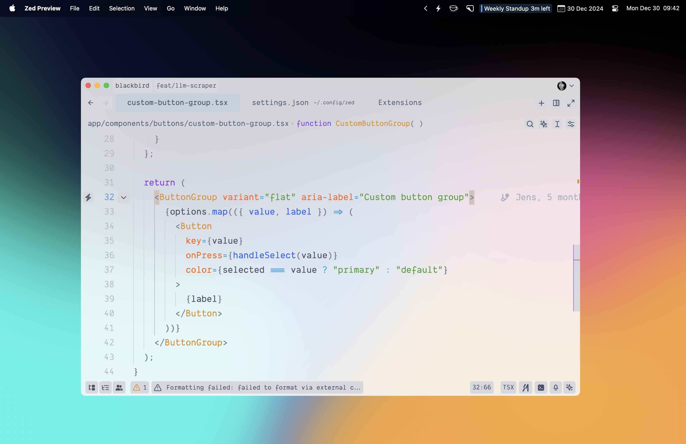
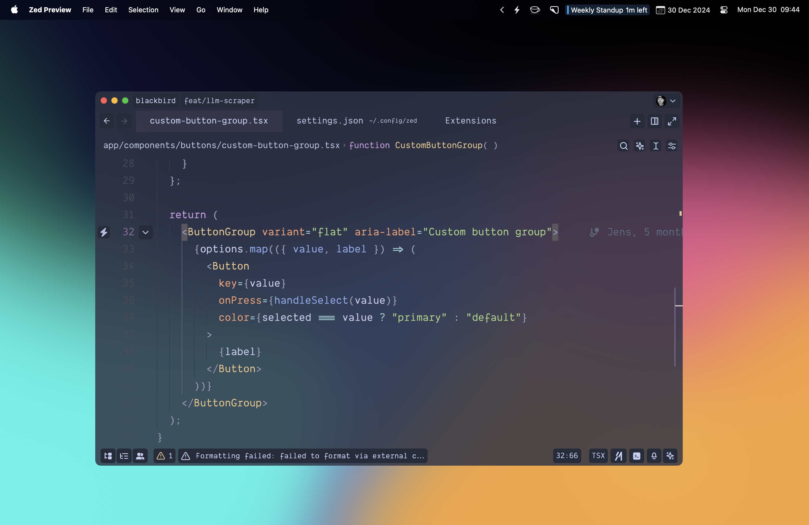
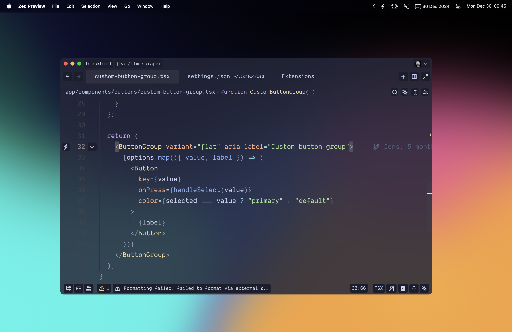
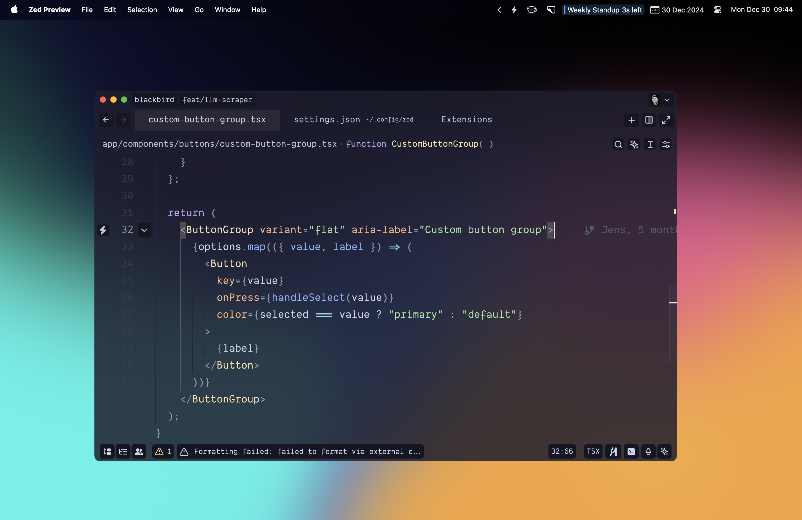
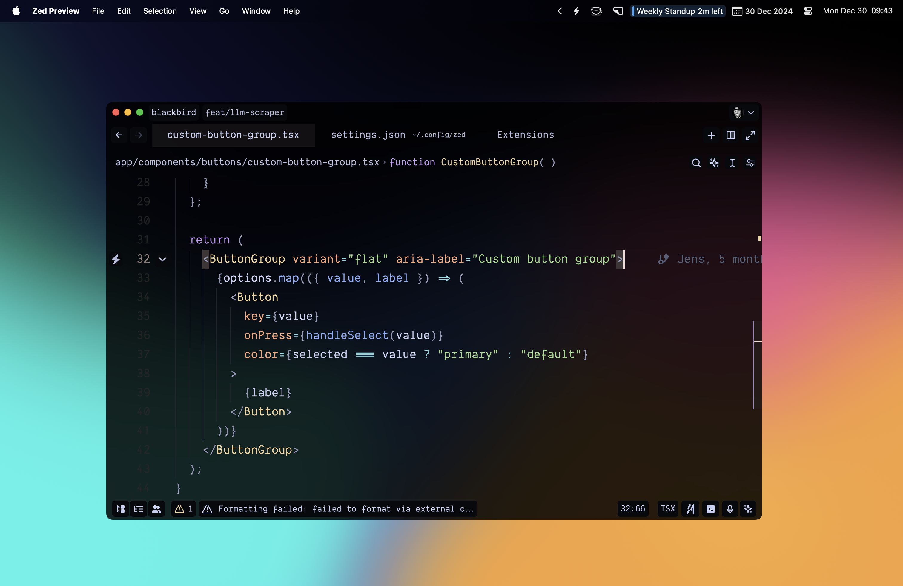

# 🌿 Catppuccin Blur for Zed

> **Note**
> The blur effect may not work on all operating systems. This is a limitation of Zed's window transparency implementation, not a theme issue. If you experience issues with blur, please report them to the [Zed repository](https://github.com/zed-industries/zed).

> **Note**
> This is an opinionated fork of the original Catppuccin theme. In addition to the blur effects, it includes various UI tweaks and modifications to create a unique visual experience. The changes go beyond just adding transparency.

<p align="center">
  <a href="https://github.com/jenslys/zed-catppuccin-blur/stargazers">
    
  </a>
  <a href="https://github.com/jenslys/zed-catppuccin-blur/issues">
    
  </a>
  <a href="https://github.com/jenslys/zed-catppuccin-blur/contributors">
    
  </a>
</p>

<p align="center">
  A modern, blurred variant of the <a href="https://github.com/catppuccin/zed">Catppuccin theme</a> for <a href="https://zed.dev">Zed</a>
</p>

## 📸 Previews

<details>
<summary>🌅 Latte</summary>

</details>
<details>
<summary>❄️ Frappé</summary>

</details>
<details>
<summary>☕ Macchiato</summary>

</details>
<details>
<summary>🌿 Mocha</summary>

</details>
<details>
<summary>🖤 Espresso</summary>

</details>

## 📦 Installation

1. Clone this repository to your local machine
2. Open the Extensions panel in Zed, click "Install Dev Extension" and select the cloned repository folder

## ⚙️ Recommended Settings

<details>
<summary>Click to expand</summary>

For the best experience with this theme, add the following to your Zed settings:

```json
{
  "project_panel": {
    "sticky_scroll": false
  }
}
```

This disables sticky scroll in the project panel, which can interfere with the blur effect on the panel overlays.
</details>

### 🎨 Recommended Icon Theme

For a cohesive visual experience, we recommend installing the [Catppuccin Icons](https://github.com/catppuccin/zed-icons) extension alongside this theme. The icon colors are specifically designed to complement the Catppuccin color palette.

## 🔧 Development

### Syncing with Upstream

This theme is kept in sync with the official Catppuccin theme using the `sync_theme.py` script. The script:

1. Fetches the latest theme from the official Catppuccin repository
2. Applies blur-specific overrides defined in `theme_overrides.py`
3. Generates the final theme file

**Important**: Do not manually edit `themes/catppuccin-blur.json` directly. All customizations should be made in the `theme_overrides.py` file. Any manual changes to the JSON file will be overwritten when the sync script runs.

To update the theme:
```bash
python3 sync_theme.py
```

### Making Theme Customizations

To customize the theme, edit the `THEME_OVERRIDES` dictionary in `theme_overrides.py`. Each variant (latte, frappe, macchiato, mocha, espresso) has its own set of overrides. For example:

```python
"latte": {
    "background": "#f9fafcd7",
    "panel.overlay_background": "#f9fafc",
    # Add more overrides here
}
```
